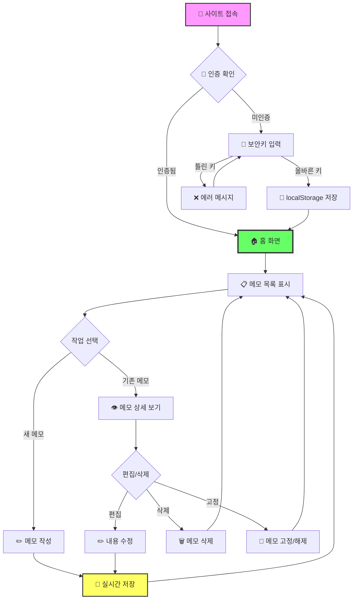
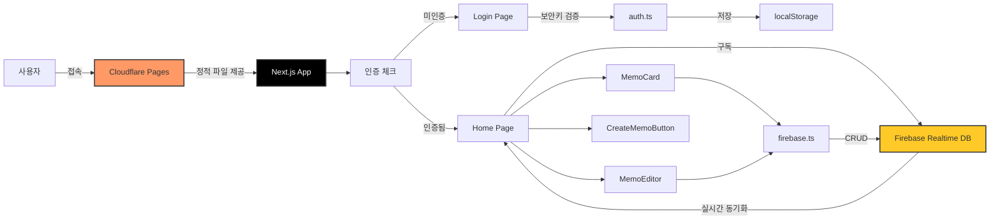

# 📝 Keep - 실시간 메모 공유 웹앱

<div align="center">

[](https://nextjs.org/)
[](https://react.dev/)
[](https://www.typescriptlang.org/)
[](https://firebase.google.com/)
[](https://tailwindcss.com/)

**친구들과 메모를 실시간으로 공유하세요!** ✨

[📖 사용 방법](#-사용-방법) | [💻 로컬 실행](#-로컬에서-실행하기) | [🏗️ 기술 스택](#️-기술-스택)

</div>

---

## 🎯 프로젝트 소개

**Keep**은 Google Keep에서 영감을 받은 **실시간 메모 공유 웹 애플리케이션**입니다.

Firebase Realtime Database를 활용하여 여러 사용자가 **동시에** 메모를 작성하고, 수정하고, 삭제할 수 있습니다. 모든 변경사항이 실시간으로 동기화되어, 팀 협업이나 친구들과의 아이디어 공유에 완벽합니다! 🚀

### ✨ 주요 기능

- 🔄 **실시간 동기화** - Firebase Realtime Database로 즉시 반영
- 📌 **메모 고정** - 중요한 메모를 상단에 고정
- 🔐 **보안키 인증** - 간단한 접근 제어로 프라이버시 보호
- 🎨 **Google Keep 스타일** - 깔끔하고 직관적인 카드 UI
- 📱 **완벽한 반응형** - 모바일, 태블릿, 데스크톱 모두 지원
- ⚡ **빠른 로딩** - Next.js 최적화로 초고속 사용자 경험
- 💾 **자동 저장** - 작성 즉시 클라우드에 저장

---

## 📸 스크린샷

<div align="center">

### 🔐 로그인 화면


*보안키를 입력하여 메모 공간에 입장합니다*

### 🏠 홈 화면


*카드 형태로 정리된 메모 목록을 한눈에 확인*

</div>

---

## 🎮 사용 방법



### 📝 단계별 가이드

1. **접속하기**
   - 사이트에 접속하면 자동으로 인증 상태 확인
   - 처음 방문 시 로그인 페이지로 이동

2. **보안키 입력**
   - 공유받은 보안키를 입력
   - 한 번 입력하면 브라우저에 저장되어 다음부터 자동 로그인
   - 틀린 키 입력 시 에러 메시지 표시

3. **메모 작성하기**
   - 상단의 "메모 작성..." 버튼 클릭
   - 제목과 내용 입력 후 자동 저장
   - 중요한 메모는 📌 아이콘으로 고정 가능

4. **메모 관리하기**
   - 카드 클릭으로 상세 보기/편집
   - 고정된 메모는 "고정됨" 섹션에 표시
   - 불필요한 메모는 삭제 버튼으로 제거

5. **실시간 협업**
   - 다른 사용자의 변경사항이 즉시 반영
   - 새로고침 없이 최신 상태 유지

---

## 🏗️ 기술 스택

<div align="center">

| 카테고리 | 기술 |
|---------|------|
| **프레임워크** | Next.js 14.2 (App Router) |
| **라이브러리** | React 18.3 |
| **언어** | TypeScript 5.9 |
| **스타일링** | Tailwind CSS 3.4 |
| **데이터베이스** | Firebase Realtime Database |
| **인증** | localStorage + 환경변수 |
| **배포** | Cloudflare Pages |
| **빌드 방식** | Static Export |

</div>

### 🎨 아키텍처



---

## 📁 프로젝트 구조

```
keep/
├── src/
│   ├── app/                      # Next.js App Router
│   │   ├── page.tsx             # 🚦 루트 (리다이렉트 처리)
│   │   ├── login/
│   │   │   └── page.tsx         # 🔐 로그인 페이지
│   │   ├── home/
│   │   │   └── page.tsx         # 🏠 메모 목록 페이지
│   │   ├── layout.tsx           # 레이아웃 (메타데이터)
│   │   └── globals.css          # 전역 스타일
│   ├── components/
│   │   ├── MemoCard.tsx         # 📋 메모 카드 컴포넌트
│   │   ├── MemoEditor.tsx       # ✏️ 메모 편집 모달
│   │   └── CreateMemoButton.tsx # ➕ 메모 생성 버튼
│   ├── lib/
│   │   ├── firebase.ts          # 🔥 Firebase 설정 및 CRUD
│   │   └── auth.ts              # 🔐 인증 유틸리티
│   └── types/
│       └── memo.ts              # 📝 TypeScript 타입 정의
├── docs/
│   └── screenshots/             # 📸 스크린샷 이미지
├── .env.local                   # 🔒 환경변수 (gitignore)
├── .env.example                 # 📋 환경변수 예시
├── next.config.js               # Next.js 설정
├── tailwind.config.js           # Tailwind CSS 설정
├── tsconfig.json                # TypeScript 설정
└── package.json                 # 프로젝트 의존성
```

---

## 💻 로컬에서 실행하기

코드를 잘 모르는 분들도 쉽게 따라할 수 있도록 자세히 설명합니다!

### 📋 사전 준비물

시작하기 전에 컴퓨터에 다음 프로그램들을 설치해야 합니다:

1. **Node.js** - JavaScript 실행 환경
   - [Node.js 공식 사이트](https://nodejs.org/)에서 다운로드
   - LTS(Long Term Support) 버전 설치 권장 (버전 18 이상)
   - 설치 후 터미널에서 확인:
     ```bash
     node --version
     npm --version
     ```

2. **Git** (선택사항) - 코드 다운로드용
   - [Git 공식 사이트](https://git-scm.com/)에서 다운로드
   - 또는 GitHub에서 ZIP 파일로 다운로드 가능

### 🚀 실행 방법

#### 방법 1: Git 사용하기 (추천)

```bash
# 1️⃣ 프로젝트 다운로드
git clone https://github.com/YOUR_USERNAME/keep.git

# 2️⃣ 프로젝트 폴더로 이동
cd keep

# 3️⃣ 필요한 패키지 설치 (처음 한 번만)
npm install

# 4️⃣ 환경변수 설정
cp .env.example .env.local
# .env.local 파일을 열어 Firebase URL과 보안키 설정

# 5️⃣ 개발 서버 실행
npm run dev
```

#### 방법 2: ZIP 다운로드

1. GitHub 저장소에서 `Code` → `Download ZIP` 클릭
2. 압축 해제 후 해당 폴더에서 터미널 열기
3. 아래 명령어 실행:

```bash
# 필요한 패키지 설치
npm install

# 환경변수 설정
cp .env.example .env.local
# .env.local 파일 수정

# 개발 서버 실행
npm run dev
```

### 🔧 환경변수 설정

`.env.local` 파일에 다음 값을 설정하세요:

```env
NEXT_PUBLIC_FIREBASE_DATABASE_URL=your-firebase-database-url
NEXT_PUBLIC_ACCESS_KEY=your-secret-access-key
```

### 🌐 브라우저에서 확인

명령어 실행 후 브라우저에서 다음 주소로 접속하세요:

```
http://localhost:3000
```

이제 로컬에서 Keep 메모 앱을 사용할 수 있습니다! 🎉

### ⚙️ 사용 가능한 명령어

| 명령어 | 설명 |
|-------|------|
| `npm run dev` | 개발 서버 실행 (포트 3000) |
| `npm run build` | 프로덕션 빌드 생성 |
| `npm run start` | 빌드된 앱 실행 |
| `npm run lint` | 코드 검사 |

### 🔧 문제 해결

**포트 3000이 이미 사용 중인 경우:**
```bash
# Windows
netstat -ano | findstr :3000
taskkill /PID [PID번호] /F

# Mac/Linux
lsof -ti:3000 | xargs kill
```

**패키지 설치 오류가 발생하는 경우:**
```bash
# node_modules 폴더와 package-lock.json 삭제
rm -rf node_modules package-lock.json

# 재설치
npm install
```

---

## 🌍 배포

이 프로젝트는 **Cloudflare Pages**에 배포되어 있습니다.

### 🔗 배포 URL

**[https://keepi.pages.dev/home](https://keepi.pages.dev/home)**

### 📦 배포 설정

```javascript
// next.config.js
module.exports = {
  output: 'export',           // 정적 HTML로 빌드
  trailingSlash: true,        // URL 끝에 / 추가
  images: {
    unoptimized: true,        // 이미지 최적화 비활성화
  },
}
```

### 🚀 직접 배포하기

1. **빌드 생성**
   ```bash
   npm run build
   ```

2. **Cloudflare Pages에 배포**
   - [Cloudflare Dashboard](https://dash.cloudflare.com/) 접속
   - Pages → Create a project
   - GitHub 저장소 연결
   - Build settings:
     - Build command: `npm run build`
     - Build output directory: `out`

3. **환경변수 설정**
   - Settings → Environment variables
   - `NEXT_PUBLIC_FIREBASE_DATABASE_URL` 추가
   - `NEXT_PUBLIC_ACCESS_KEY` 추가

---

## 🧮 핵심 기술 구현

### 🔄 실시간 데이터 구독

```typescript
// Firebase Realtime Database 구독
export function subscribeMemos(callback: (memos: Memo[]) => void) {
  const memosRef = ref(database, 'memos');

  onValue(memosRef, (snapshot) => {
    const data = snapshot.val();
    const memos = Object.entries(data).map(([id, value]) => ({
      id,
      ...value,
    }));
    callback(memos);
  });
}
```

### 🔐 보안키 인증

```typescript
// localStorage 기반 인증 상태 관리
export function isAuthenticated(): boolean {
  const savedKey = localStorage.getItem('keep_access_key');
  if (!savedKey) return false;
  return savedKey === process.env.NEXT_PUBLIC_ACCESS_KEY;
}
```

### 📌 메모 정렬 로직

```typescript
// 고정 메모 우선, 최신 수정순 정렬
memos.sort((a, b) => {
  if (a.pinned !== b.pinned) {
    return a.pinned ? -1 : 1;  // 고정된 메모 우선
  }
  return b.updatedAt - a.updatedAt;  // 최신순
});
```

---

## 🎯 향후 개선 사항

- [ ] 🔑 Firebase Authentication 도입 (실제 사용자 인증)
- [ ] 🏷️ 메모 라벨/태그 기능
- [ ] 🎨 메모 배경색 선택
- [ ] 🔍 메모 검색 기능
- [ ] 📤 메모 내보내기 (Markdown, PDF)
- [ ] 🌙 다크모드 지원
- [ ] 📱 PWA 지원 (오프라인 사용)
- [ ] 👥 사용자별 메모 분리
- [ ] 🗂️ 폴더/카테고리 기능
- [ ] 🔔 알림 기능 (리마인더)

---

## 📄 라이선스

이 프로젝트는 MIT 라이선스를 따릅니다.
자유롭게 사용하셔도 됩니다.

---

## 👨‍💻 만든 사람

**Jongwoo**

궁금한 점이나 제안사항이 있으시면 Issue를 남겨주세요!

---

<div align="center">

**⭐ 이 프로젝트가 마음에 드셨다면 Star를 눌러주세요! ⭐**

Made with ❤️ using Next.js, Firebase & TypeScript

[📝 지금 사용하기](https://keepi.pages.dev/home)

</div>
