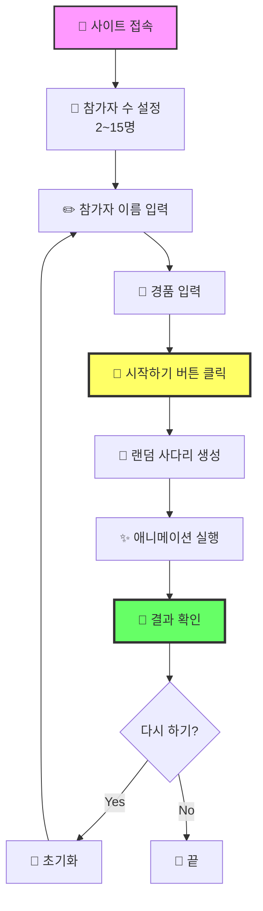
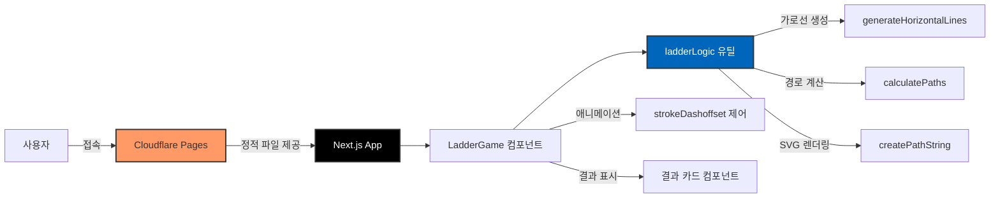
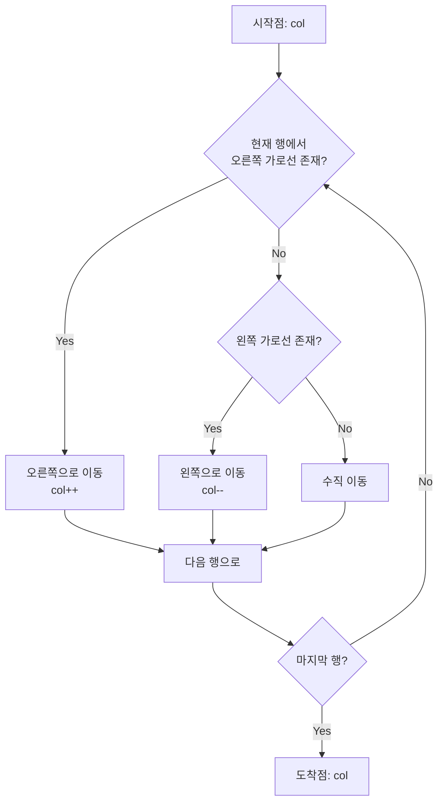

# 🪜 사다리타기 - Interactive Ladder Game

<div align="center">

[](https://ladderi.pages.dev/)
[](https://nextjs.org/)
[](https://www.typescriptlang.org/)
[](https://tailwindcss.com/)

**공정한 추첨을 위한 랜덤 사다리 게임** ✨

[🎮 지금 플레이하기](https://ladderi.pages.dev/) | [📖 사용 방법](#-사용-방법) | [💻 로컬 실행](#-로컬에서-실행하기)

</div>

---

## 🎯 프로젝트 소개

사다리타기는 **2~15명**까지 참여할 수 있는 인터랙티브 웹 게임입니다.

참가자 이름과 경품을 입력하면, 랜덤으로 생성된 사다리를 통해 공정하게 결과가 결정됩니다. 화려한 애니메이션과 함께 각 참가자가 어떤 경품을 받게 되는지 확인할 수 있습니다!

### ✨ 주요 기능

- 🎲 **랜덤 사다리 생성** - 매번 다른 결과를 보장하는 완전 랜덤 알고리즘
- 🎨 **15가지 색상** - 각 참가자를 구분하는 아름다운 컬러 시스템
- ⚡ **실시간 애니메이션** - 모든 참가자가 동시에 사다리를 타는 생동감 있는 애니메이션
- 📱 **완벽한 반응형** - 모바일, 태블릿, 데스크톱 모두 지원
- 🚀 **빠른 로딩** - 정적 사이트로 빌드되어 초고속 로딩
- 🌐 **오프라인 동작** - 모든 연산이 클라이언트에서 처리

---

## 🎮 사용 방법



### 📝 단계별 가이드

1. **참가자 수 설정하기**
   - `+` / `-` 버튼으로 조절하거나 직접 숫자 입력
   - 최소 2명, 최대 15명까지 가능
   - `적용` 버튼을 눌러 사다리 생성

2. **정보 입력하기**
   - 상단: 각 참가자의 이름 입력
   - 하단: 각 결과(경품) 입력
   - 비워두면 기본값(참가자1, 경품1 등)으로 표시

3. **게임 시작하기**
   - `🚀 시작하기` 버튼 클릭
   - 자동으로 가로선(다리)이 랜덤 생성
   - 각 참가자가 고유 색상으로 사다리를 타는 애니메이션 시작

4. **결과 확인하기**
   - 애니메이션 종료 후 매칭 결과 표시
   - 각 참가자가 어떤 경품을 받았는지 색상으로 구분
   - 하단 결과 카드에서 전체 매칭 확인 가능

5. **다시 하기**
   - `🔄 초기화` 버튼으로 이름/경품만 초기화
   - 참가자 수는 유지되어 빠르게 재시작 가능

---

## 🏗️ 기술 스택

<div align="center">

| 카테고리 | 기술 |
|---------|------|
| **프레임워크** | Next.js 16 (App Router) |
| **언어** | TypeScript 5.9 |
| **스타일링** | Tailwind CSS 3.4 |
| **배포** | Cloudflare Pages |
| **빌드 방식** | Static Export (`output: 'export'`) |

</div>

### 🎨 아키텍처



---

## 💻 로컬에서 실행하기

코드를 잘 모르는 분들도 쉽게 따라할 수 있도록 자세히 설명합니다!

### 📋 사전 준비물

시작하기 전에 컴퓨터에 다음 프로그램들을 설치해야 합니다:

1. **Node.js** - JavaScript 실행 환경
   - [Node.js 공식 사이트](https://nodejs.org/)에서 다운로드
   - LTS(Long Term Support) 버전 설치 권장 (버전 18 이상)
   - 설치 후 터미널에서 확인:
     ```bash
     node --version
     npm --version
     ```

2. **Git** (선택사항) - 코드 다운로드용
   - [Git 공식 사이트](https://git-scm.com/)에서 다운로드
   - 또는 GitHub에서 ZIP 파일로 다운로드 가능

### 🚀 실행 방법

#### 방법 1: Git 사용하기 (추천)

```bash
# 1️⃣ 프로젝트 다운로드
git clone https://github.com/YOUR_USERNAME/ladder.git

# 2️⃣ 프로젝트 폴더로 이동
cd ladder

# 3️⃣ 필요한 패키지 설치 (처음 한 번만)
npm install

# 4️⃣ 개발 서버 실행
npm run dev
```

#### 방법 2: ZIP 다운로드

1. GitHub 저장소에서 `Code` → `Download ZIP` 클릭
2. 압축 해제 후 해당 폴더에서 터미널 열기
3. 아래 명령어 실행:

```bash
# 필요한 패키지 설치
npm install

# 개발 서버 실행
npm run dev
```

### 🌐 브라우저에서 확인

명령어 실행 후 브라우저에서 다음 주소로 접속하세요:

```
http://localhost:3000
```

이제 로컬에서 사다리타기 게임을 즐길 수 있습니다! 🎉

### ⚙️ 사용 가능한 명령어

| 명령어 | 설명 |
|-------|------|
| `npm run dev` | 개발 서버 실행 (포트 3000) |
| `npm run build` | 프로덕션 빌드 생성 |
| `npm run start` | 빌드된 앱 실행 |
| `npm run lint` | 코드 검사 |

### 🔧 문제 해결

**포트 3000이 이미 사용 중인 경우:**
```bash
# Windows
netstat -ano | findstr :3000
taskkill /PID [PID번호] /F

# Mac/Linux
lsof -ti:3000 | xargs kill
```

**패키지 설치 오류가 발생하는 경우:**
```bash
# node_modules 폴더와 package-lock.json 삭제
rm -rf node_modules package-lock.json

# 재설치
npm install
```

---

## 📁 프로젝트 구조

```
ladder/
├── src/
│   ├── app/                    # Next.js App Router
│   │   ├── page.tsx           # 메인 페이지
│   │   ├── layout.tsx         # 레이아웃 (메타데이터, 폰트)
│   │   └── globals.css        # 전역 스타일
│   ├── components/
│   │   └── LadderGame.tsx     # 사다리 게임 메인 컴포넌트
│   └── utils/
│       └── ladderLogic.ts     # 사다리 로직 (알고리즘)
├── public/                     # 정적 파일
├── next.config.js             # Next.js 설정 (static export)
├── tailwind.config.ts         # Tailwind CSS 설정
├── tsconfig.json              # TypeScript 설정
└── package.json               # 프로젝트 의존성
```

---

## 🧮 핵심 알고리즘

### 가로선 생성 로직

```typescript
// 사다리 규칙: 같은 높이에서 연속된 가로선 생성 금지
function generateHorizontalLines(participantCount, rowCount) {
  const lines = []

  for (let row = 0; row < rowCount; row++) {
    for (let col = 0; col < participantCount - 1; col++) {
      // 이전 열에 가로선이 없고, 50% 확률로 생성
      if (!hasPreviousLine(row, col - 1) && Math.random() < 0.5) {
        lines.push({ row, col })
      }
    }
  }

  return lines
}
```

### 경로 계산 로직



---

## 🎨 디자인 특징

### 🌈 색상 시스템

15가지 참가자별 고유 색상:

<div align="center">

| 색상 | HEX | 이름 |
|-----|-----|------|
| 🔴 | `#FF6B6B` | 빨강 |
| 🔵 | `#4ECDC4` | 청록 |
| 🟡 | `#FFE66D` | 노랑 |
| 🟢 | `#95E1D3` | 민트 |
| 🟠 | `#FF9F43` | 주황 |
| 🟣 | `#AA96DA` | 라벤더 |
| 🩷 | `#FCBAD3` | 핑크 |
| ... | ... | 총 15가지 |

</div>

### ✨ 애니메이션

- **SVG strokeDashoffset** - 경로 그리기 애니메이션
- **CSS Keyframes** - 결과 카드 페이드인
- **requestAnimationFrame** - 부드러운 프로그레스 제어
- **2.5초 동기화** - 모든 참가자 동시 애니메이션

---

## 🌍 배포

이 프로젝트는 **Cloudflare Pages**에 배포되어 있습니다.

### 🔗 배포 URL

**[https://ladderi.pages.dev](https://ladderi.pages.dev)**

### 📦 배포 설정

```javascript
// next.config.js
module.exports = {
  output: 'export',           // 정적 HTML로 빌드
  trailingSlash: true,        // URL 끝에 / 추가
  images: {
    unoptimized: true,        // 이미지 최적화 비활성화
  },
}
```

### 🚀 직접 배포하기

1. **빌드 생성**
   ```bash
   npm run build
   ```

2. **out 폴더 확인**
   - 빌드 완료 후 `out` 폴더에 정적 파일 생성

3. **Cloudflare Pages에 배포**
   - [Cloudflare Dashboard](https://dash.cloudflare.com/) 접속
   - Pages → Create a project
   - GitHub 저장소 연결
   - Build settings:
     - Build command: `npm run build`
     - Build output directory: `out`

---

## 🎯 향후 개선 사항

- [ ] 애니메이션 속도 조절 기능
- [ ] 결과 이미지 저장/공유
- [ ] 다크모드/라이트모드 토글
- [ ] 사운드 효과 추가
- [ ] 사다리 테마 선택 (색상, 스타일)
- [ ] 결과 히스토리 저장 (로컬 스토리지)

---

## 📄 라이선스

이 프로젝트는 MIT 라이선스를 따릅니다.
자유롭게 사용하셔도 됩니다.

---

## 👨‍💻 만든 사람

**Jonghyun**

궁금한 점이나 제안사항이 있으시면 Issue를 남겨주세요!

---

<div align="center">

**⭐ 이 프로젝트가 마음에 드셨다면 Star를 눌러주세요! ⭐**

Made with ❤️ using Next.js & TypeScript

[🎮 지금 플레이하기](https://ladderi.pages.dev/)

</div>
