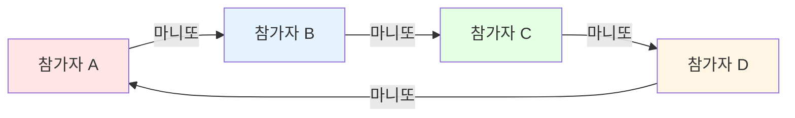
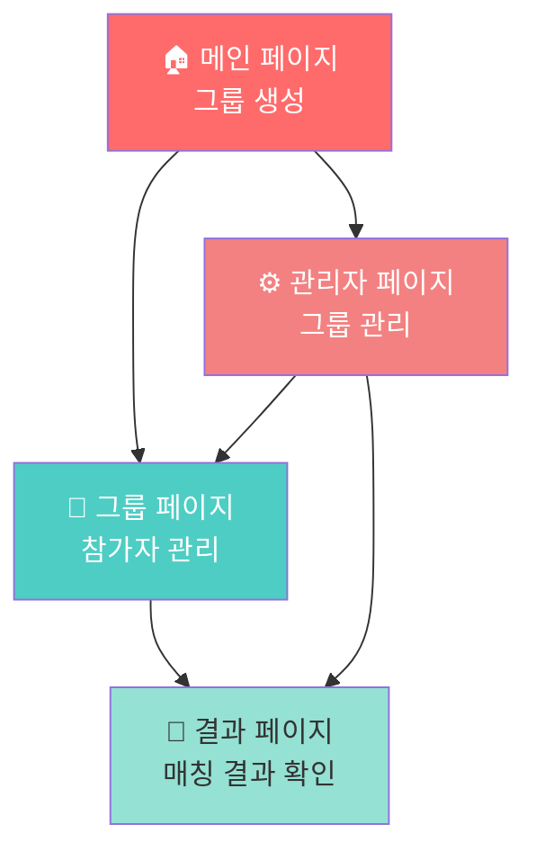

# 🎁 마니또 (Manitto)

<div align="center">

[](https://manitto.pages.dev/)
[](https://nextjs.org/)
[](https://react.dev/)
[](https://www.typescriptlang.org/)
[](https://tailwindcss.com/)

**비밀 친구를 자동으로 매칭해주는 웹 애플리케이션** ✨

[🎮 지금 시작하기](https://manitto.pages.dev/) | [📖 사용 방법](#-사용-방법) | [💻 로컬 실행](#-로컬에서-실행하기)

</div>

---

## 📖 목차

- [소개](#-소개)
- [주요 기능](#-주요-기능)
- [시작하기](#-시작하기)
- [사용 방법](#-사용-방법)
- [프로젝트 구조](#-프로젝트-구조)
- [기술 스택](#-기술-스택)
- [개발 가이드](#-개발-가이드)

---

## 🎯 소개

**마니또**는 친구들, 동료들과 함께 즐길 수 있는 비밀 친구 매칭 서비스입니다.
학교, 회사, 동호회 등에서 마니또 게임을 쉽게 진행할 수 있도록 자동으로 순환 매칭을 생성해줍니다.

### ✨ 특별한 점

- 🎲 **완벽한 순환 매칭**: 모든 참가자가 빠짐없이 한 명의 마니또와 한 명의 마니또를 가집니다
- 🔐 **비밀번호 자동 생성**: "귀여운호랑이", "빛나는별" 같은 기억하기 쉬운 한글 비밀번호 자동 생성
- 📱 **반응형 디자인**: 모바일, 태블릿, 데스크톱 모든 기기에서 완벽하게 작동
- 🌓 **다크모드 지원**: 사용자의 시스템 설정에 따라 자동으로 테마 변경
- 💾 **로컬 스토리지**: 별도의 서버 없이 브라우저에 데이터 저장

---

## 🚀 주요 기능

### 1️⃣ 그룹 생성
그룹명과 리더 이름을 입력하여 새로운 마니또 그룹을 만듭니다.

### 2️⃣ 참가자 관리
- ➕ 참가자 이름 추가
- ✏️ 참가자 이름 수정
- 🗑️ 참가자 삭제
- 📋 스크롤 가능한 참가자 목록 (수십 명도 가능!)

### 3️⃣ 자동 매칭
최소 2명 이상의 참가자가 있으면 **매칭 시작** 버튼을 눌러 자동으로 순환 매칭을 생성합니다.



### 4️⃣ 관리자 페이지
- 🔍 비밀번호로 매칭 결과 조회
- 📋 생성된 모든 그룹 목록 확인
- 👁️ 각 그룹의 상세 정보 보기
- 🗑️ 그룹 삭제 기능

---

## 📱 페이지 구조



| 페이지 | 경로 | 설명 |
|--------|------|------|
| 메인 | `/` | 그룹 생성 시작점 |
| 그룹 관리 | `/group?id={groupId}` | 참가자 추가 및 매칭 시작 |
| 결과 | `/result?id={groupId}` | 매칭 결과 확인 |
| 관리자 | `/admin` | 전체 그룹 관리 |

---

## 🛠️ 시작하기

### 필요한 것들

프로젝트를 실행하기 위해서는 다음이 필요합니다:

1. **Node.js** (버전 18 이상 권장)
   - [Node.js 공식 웹사이트](https://nodejs.org/)에서 다운로드
   - 설치 확인: 터미널에서 `node --version` 입력

2. **패키지 매니저**
   - npm (Node.js와 함께 자동 설치됨)
   - 또는 yarn, pnpm 사용 가능

### 🏃 로컬에서 실행하기

#### 1단계: 프로젝트 다운로드

```bash
# Git이 설치되어 있다면
git clone https://github.com/your-username/manitto.git
cd manitto

# 또는 ZIP 파일로 다운로드 후 압축 해제
```

#### 2단계: 의존성 설치

터미널(또는 명령 프롬프트)을 열고 프로젝트 폴더로 이동한 후:

```bash
npm install
```

이 명령어는 프로젝트에 필요한 모든 패키지를 자동으로 설치합니다.
처음 실행 시 몇 분 정도 걸릴 수 있습니다. ☕

#### 3단계: 개발 서버 실행

```bash
npm run dev
```

다음과 같은 메시지가 나타나면 성공입니다:

```
▲ Next.js 16.0.5
- Local:        http://localhost:3000
```

#### 4단계: 브라우저에서 확인

웹 브라우저를 열고 주소창에 입력:

```
http://localhost:3000
```

🎉 마니또 앱이 실행됩니다!

### 🛑 종료하기

터미널에서 `Ctrl + C` (또는 Mac에서 `Cmd + C`)를 누르면 개발 서버가 종료됩니다.

---

## 📚 사용 방법

### Step 1: 그룹 만들기

1. 메인 페이지에 접속
2. **그룹명** 입력 (예: "개발팀 마니또")
3. **리더 이름** 입력 (예: "홍길동")
4. **그룹 생성** 버튼 클릭

> 💡 **팁**: 같은 그룹명과 리더 이름이 이미 있으면 중복 오류가 발생합니다!

### Step 2: 참가자 추가

1. 그룹 페이지로 자동 이동
2. 🔐 **그룹 비밀번호** 확인 (자동 생성됨)
3. 참가자 이름을 입력하고 **이름 추가** 클릭
4. 필요한 만큼 반복 (최소 2명 필요)

```
예시 참가자 목록:
✅ 홍길동
✅ 김철수
✅ 이영희
✅ 박민수
```

### Step 3: 매칭 시작

1. 참가자가 2명 이상이면 **🎲 매칭 시작** 버튼 활성화
2. 버튼을 클릭하면 자동으로 순환 매칭 생성
3. 결과 페이지로 자동 이동

### Step 4: 결과 확인

```
🎉 전체 결과 🎉
리더: 홍길동 | 그룹명: 개발팀 마니또

홍길동 ➡️ 김철수
김철수 ➡️ 이영희
이영희 ➡️ 박민수
박민수 ➡️ 홍길동
```

### 🔍 나중에 다시 보기

1. 메인 페이지에서 **⚙️ 관리자 페이지** 클릭
2. 그룹 비밀번호 입력하고 **조회** 클릭
3. 또는 하단의 전체 그룹 목록에서 확인

---

## 🏗️ 프로젝트 구조

```
manitto/
├── app/                    # Next.js 앱 라우터
│   ├── page.tsx           # 🏠 메인 페이지 (그룹 생성)
│   ├── group/
│   │   └── page.tsx       # 👥 그룹 페이지 (참가자 관리)
│   ├── result/
│   │   └── page.tsx       # 🎉 결과 페이지 (매칭 결과)
│   ├── admin/
│   │   └── page.tsx       # ⚙️ 관리자 페이지
│   └── layout.tsx         # 공통 레이아웃
│
├── components/            # 재사용 가능한 컴포넌트
│   ├── MemberList.tsx    # 참가자 목록 컴포넌트
│   └── MatchingResult.tsx # 매칭 결과 컴포넌트
│
├── lib/                   # 핵심 로직
│   ├── types.ts          # TypeScript 타입 정의
│   ├── storage.ts        # 로컬 스토리지 관리
│   ├── matching.ts       # 순환 매칭 알고리즘
│   └── password.ts       # 비밀번호 생성기
│
├── data/
│   └── words.json        # 비밀번호용 한글 단어 데이터
│
├── public/               # 정적 파일
├── package.json          # 프로젝트 설정 및 의존성
└── README.md            # 📖 이 문서!
```

---

## 💻 기술 스택

### 프레임워크 & 라이브러리

| 기술 | 버전 | 용도 |
|------|------|------|
|  | 16.0.5 | React 기반 풀스택 프레임워크 |
|  | 19.2.0 | UI 컴포넌트 라이브러리 |
|  | 5.x | 타입 안정성 |
|  | 4.x | 유틸리티 기반 CSS 프레임워크 |

### 핵심 알고리즘

#### 🎲 Fisher-Yates 셔플 알고리즘
참가자를 무작위로 섞어 공정한 매칭을 보장합니다.

```typescript
function shuffle<T>(array: T[]): T[] {
  const shuffled = [...array];
  for (let i = shuffled.length - 1; i > 0; i--) {
    const j = Math.floor(Math.random() * (i + 1));
    [shuffled[i], shuffled[j]] = [shuffled[j], shuffled[i]];
  }
  return shuffled;
}
```

#### 🔄 순환 매칭 생성
각 참가자가 다음 참가자를 가리키는 완벽한 순환 구조를 만듭니다.

```typescript
export function createCircularMatching(members: string[]): Matching[] {
  const shuffled = shuffle(members);
  const matchings: Matching[] = [];

  for (let i = 0; i < shuffled.length; i++) {
    const from = shuffled[i];
    const to = shuffled[(i + 1) % shuffled.length];
    matchings.push({ from, to });
  }

  return matchings;
}
```

#### 🔐 비밀번호 생성기
형용사 + 명사 조합으로 기억하기 쉬운 한글 비밀번호를 생성합니다.

```typescript
// 41개 형용사 × 40개 명사 = 1,640가지 조합
예시: "빛나는호랑이", "귀여운토끼", "용감한독수리"
```

---

## 🔧 개발 가이드

### 사용 가능한 스크립트

```bash
# 개발 서버 실행 (http://localhost:3000)
npm run dev

# 프로덕션 빌드 생성
npm run build

# 프로덕션 서버 실행 (빌드 후)
npm run start

# 코드 린팅 (코드 품질 검사)
npm run lint
```

### 배포

이 프로젝트는 **Cloudflare Pages**에 배포되어 있습니다.

#### Cloudflare Pages 배포 방법

1. [Cloudflare Pages](https://pages.cloudflare.com/)에 로그인
2. Git 저장소 연결
3. 빌드 설정:
   - **Build command**: `npm run build`
   - **Build output directory**: `.next`
   - **Framework preset**: Next.js (Static HTML Export)

> ⚠️ **주의**: 동적 라우트를 사용하지 않도록 정적 빌드로 설정되어 있습니다.

### 환경 설정

현재 별도의 환경 변수가 필요하지 않습니다. 모든 데이터는 브라우저의 로컬 스토리지에 저장됩니다.

---

## 🤝 기여하기

버그 리포트나 기능 제안은 언제나 환영합니다!

1. 이 저장소를 Fork 하세요
2. 새로운 브랜치를 만드세요 (`git checkout -b feature/amazing-feature`)
3. 변경사항을 커밋하세요 (`git commit -m 'Add some amazing feature'`)
4. 브랜치에 Push 하세요 (`git push origin feature/amazing-feature`)
5. Pull Request를 열어주세요

---

## 📝 라이선스

이 프로젝트는 개인 학습 및 비상업적 용도로 자유롭게 사용 가능합니다.

---

## 💬 문의

프로젝트에 대한 질문이나 제안이 있으시면 이슈를 등록해주세요!

---

<div align="center">

**🎁 마니또와 함께 즐거운 시간 보내세요! 🎁**

Made with ❤️ using Next.js & TypeScript

[🌐 사이트 방문하기](https://manitto.pages.dev/)

</div>
