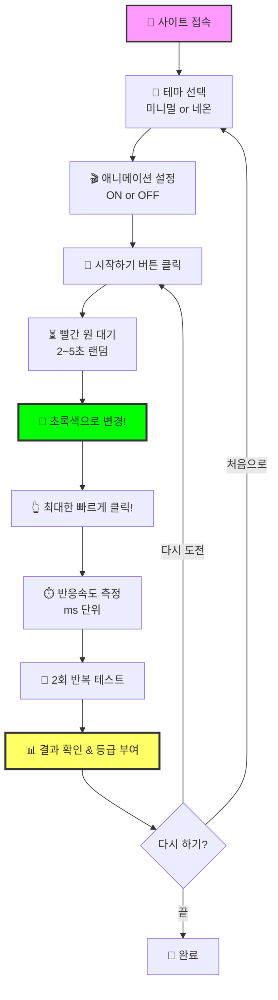
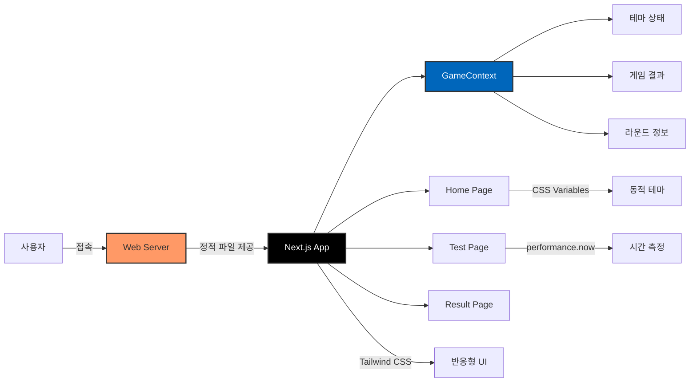

# ⚡ 반응속도 테스트 - Reaction Time Test

<div align="center">

[](https://reactioni.pages.dev/)
[](https://nextjs.org/)
[](https://react.dev/)
[](https://www.typescriptlang.org/)
[](https://tailwindcss.com/)

**당신의 반응속도를 정밀하게 측정하고 등급을 확인해보세요!** ✨

[🎯 사용 방법](#-사용-방법) | [💻 로컬 실행](#-로컬에서-실행하기) | [📊 등급 시스템](#-등급-시스템)

</div>

---

## 🎯 프로젝트 소개

반응속도 테스트는 사용자의 **시각적 반응 속도를 정밀하게 측정**하는 인터랙티브 웹 게임입니다.

빨간 원이 초록색으로 바뀌는 순간을 포착하여 클릭하면, 밀리초 단위로 당신의 반응 시간을 측정하고 등급을 매겨줍니다! 프로게이머 수준인지 확인해보세요! 🏆

### ✨ 주요 기능

- 🎯 **정밀 측정** - `performance.now()` API를 사용한 밀리초 단위 정확한 시간 측정
- 🎨 **2가지 테마** - 미니멀과 네온 사이버펑크 스타일 중 선택
- 🎬 **애니메이션 제어** - 정확한 측정을 위한 애니메이션 on/off 기능
- 📱 **완벽한 반응형** - 모바일, 태블릿, 데스크톱 모두 지원
- ⭐ **등급 시스템** - 5단계 별점 평가 (프로게이머 vs 일반인)
- 🚀 **초고속 로딩** - Next.js 최적화로 빠른 사용자 경험
- 💾 **서버 불필요** - 클라이언트 사이드만으로 동작하는 가벼운 앱

---

## 🎮 사용 방법



### 📝 단계별 가이드

1. **테마 선택하기**
   - ✨ **미니멀**: 깔끔하고 모던한 디자인
   - 🌃 **네온**: 사이버펑크 감성의 화려한 스타일

2. **애니메이션 설정**
   - **ON**: 빨간 원이 깜빡이며 긴장감 UP
   - **OFF**: 정적인 원으로 더 정확한 측정 가능

3. **테스트 진행**
   - 빨간 원이 표시되면 **기다리세요**
   - 2~5초 사이 랜덤 시간 후 **초록색으로 변경**
   - 초록색으로 바뀌는 순간 **최대한 빠르게 클릭!**
   - 너무 빨리 클릭하면 "너무 빨라요!" 메시지와 함께 재시작

4. **결과 확인**
   - 총 2회 테스트 진행
   - 각 회차별 반응속도 기록
   - 평균 속도 계산 및 별점 등급 부여

---

## 🏗️ 기술 스택

<div align="center">

| 카테고리 | 기술 |
|---------|------|
| **프레임워크** | Next.js 16.0.5 (App Router) |
| **라이브러리** | React 19.2.0 |
| **언어** | TypeScript 5.x |
| **스타일링** | Tailwind CSS 4.0 |
| **상태 관리** | React Context API |
| **배포** | Cloudflare Pages / Vercel |
| **빌드 방식** | Static Export |

</div>

### 🎨 아키텍처



## 📁 프로젝트 구조

```
reaction/
├── src/
│   ├── app/                    # Next.js App Router
│   │   ├── page.tsx           # 🏠 메인 페이지 (테마 선택)
│   │   ├── test/
│   │   │   └── page.tsx       # 🎮 테스트 페이지
│   │   ├── result/
│   │   │   └── page.tsx       # 📊 결과 페이지
│   │   ├── layout.tsx         # 레이아웃 (메타데이터, 폰트)
│   │   └── globals.css        # 전역 스타일 (테마 변수)
│   └── contexts/
│       └── GameContext.tsx    # 게임 상태 관리 Context
├── public/                     # 정적 파일
├── package.json               # 프로젝트 의존성
├── tsconfig.json              # TypeScript 설정
├── tailwind.config.ts         # Tailwind CSS 설정
└── PRD.txt                    # 프로젝트 요구사항 문서
```

---

## 🎯 등급 시스템

| 등급 | 평균 반응속도 | 설명 | 이모지 |
|:---:|:---:|:---:|:---:|
| ⭐⭐⭐⭐⭐ | ≤ 200ms | 초인적인 반응속도! | 🏆 |
| ⭐⭐⭐⭐ | 201 ~ 260ms | 매우 빠름! | ⚡ |
| ⭐⭐⭐ | 261 ~ 350ms | 평균 이상! | 👍 |
| ⭐⭐ | 351 ~ 500ms | 평균 수준 | 😊 |
| ⭐ | > 500ms | 조금 느려요 | 🐢 |

### 📈 참고 데이터
- **일반인 평균**: 200~250ms
- **프로게이머**: 150~180ms

---

## 💻 로컬에서 실행하기

코드를 잘 모르는 분들도 쉽게 따라할 수 있도록 자세히 설명합니다!

### 📋 사전 준비물

시작하기 전에 컴퓨터에 다음 프로그램들을 설치해야 합니다:

1. **Node.js** - JavaScript 실행 환경
   - [Node.js 공식 사이트](https://nodejs.org/)에서 다운로드
   - LTS(Long Term Support) 버전 설치 권장 (버전 20 이상)
   - 설치 후 터미널에서 확인:
     ```bash
     node --version
     npm --version
     ```

2. **Git** (선택사항) - 코드 다운로드용
   - [Git 공식 사이트](https://git-scm.com/)에서 다운로드
   - 또는 GitHub에서 ZIP 파일로 다운로드 가능

### 🚀 실행 방법

#### 방법 1: Git 사용하기 (추천)

```bash
# 1️⃣ 프로젝트 다운로드
git clone <repository-url>

# 2️⃣ 프로젝트 폴더로 이동
cd reaction

# 3️⃣ 필요한 패키지 설치 (처음 한 번만)
npm install

# 4️⃣ 개발 서버 실행
npm run dev
```

#### 방법 2: ZIP 다운로드

1. GitHub 저장소에서 `Code` → `Download ZIP` 클릭
2. 압축 해제 후 해당 폴더에서 터미널 열기
3. 아래 명령어 실행:

```bash
# 필요한 패키지 설치
npm install

# 개발 서버 실행
npm run dev
```

### 🌐 브라우저에서 확인

명령어 실행 후 브라우저에서 다음 주소로 접속하세요:

```
http://localhost:3000
```

이제 로컬에서 반응속도 테스트 게임을 즐길 수 있습니다! 🎉

### ⚙️ 사용 가능한 명령어

| 명령어 | 설명 |
|-------|------|
| `npm run dev` | 개발 서버 실행 (포트 3000) |
| `npm run build` | 프로덕션 빌드 생성 |
| `npm run start` | 빌드된 앱 실행 |
| `npm run lint` | 코드 검사 |

### 🔧 문제 해결

**포트 3000이 이미 사용 중인 경우:**
```bash
# Windows
netstat -ano | findstr :3000
taskkill /PID [PID번호] /F

# Mac/Linux
lsof -ti:3000 | xargs kill
```

**패키지 설치 오류가 발생하는 경우:**
```bash
# node_modules 폴더와 package-lock.json 삭제
rm -rf node_modules package-lock.json

# 재설치
npm install
```

---

## 🧮 핵심 기술 구현

### ⏱️ 정밀 시간 측정

```typescript
// performance.now()를 사용한 밀리초 단위 측정
startTimeRef.current = performance.now();

// 사용자 클릭 시
const endTime = performance.now();
const reactionTime = Math.round(endTime - startTimeRef.current);
```

### 🎨 테마 시스템

CSS 변수를 활용한 동적 테마 전환:

```css
/* 미니멀 테마 */
[data-theme='minimal'] {
  --background: #ffffff;
  --foreground: #000000;
  --primary: #ff4444;
  --secondary: #00ff00;
}

/* 네온 테마 */
[data-theme='neon'] {
  --background: #0a0a0a;
  --foreground: #ffffff;
  --primary: #ff00ff;
  --secondary: #00ffff;
}
```

### 🎲 랜덤 타이밍

```typescript
// 2~5초 사이 랜덤 대기로 예측 불가능하게
const randomDelay = 2000 + Math.random() * 3000;
```

---

## 🌍 배포

### 🚀 직접 배포하기

**1. 빌드 생성**
```bash
npm run build
```

**2. Vercel에 배포 (권장)**
- [Vercel](https://vercel.com)에 가입
- GitHub 저장소 연결
- 자동 빌드 & 배포 완료!

[](https://vercel.com/new)

**3. Cloudflare Pages에 배포**
- Build command: `npm run build`
- Build output directory: `.next`

---

## 🎯 향후 개선 사항

- [ ] 다크모드/라이트모드 자동 감지
- [ ] 추가 테마 (레트로, 귀여운 스타일)
- [ ] 결과 이미지 저장/공유 기능
- [ ] 사운드 효과 추가
- [ ] 리더보드 (상위 기록 저장)
- [ ] 다국어 지원 (영어, 일본어)

---

## 📄 라이선스

이 프로젝트는 MIT 라이선스를 따릅니다.
자유롭게 사용하셔도 됩니다.

---

## 👨‍💻 만든 사람

**Jonghyun**

궁금한 점이나 제안사항이 있으시면 Issue를 남겨주세요!

---

<div align="center">

**⭐ 이 프로젝트가 마음에 드셨다면 Star를 눌러주세요! ⭐**

Made with ❤️ using Next.js & TypeScript

[🎮 지금 플레이하기](https://reactioni.pages.dev/)

</div>
