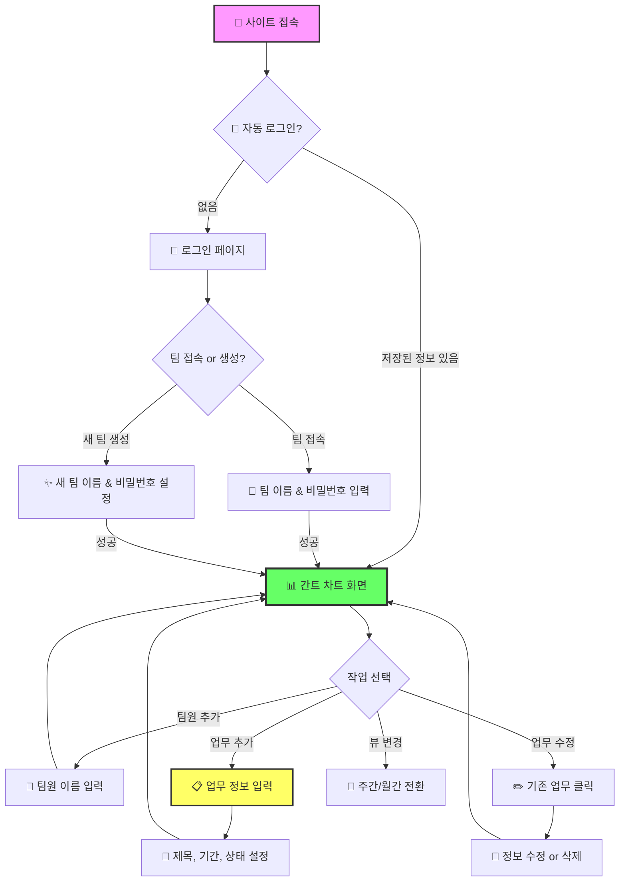
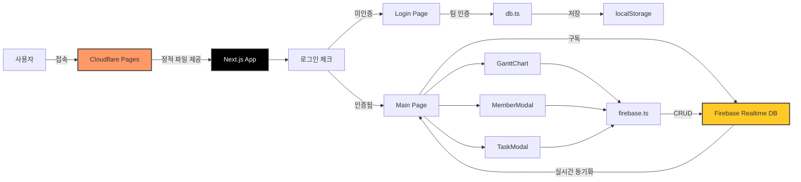

# 📊 Ganttly - 팀 일정 관리 웹앱

<div align="center">

[](https://nextjs.org/)
[](https://react.dev/)
[](https://www.typescriptlang.org/)
[](https://firebase.google.com/)
[](https://tailwindcss.com/)

**팀원들의 업무 일정을 간트 차트로 한눈에 관리하세요!** ✨

[🎯 사용 방법](#-사용-방법) | [💻 로컬 실행](#-로컬에서-실행하기) | [🏗️ 기술 스택](#️-기술-스택)

</div>

---

## 🎯 프로젝트 소개

**Ganttly**는 팀의 업무 일정을 **간트 차트(Gantt Chart)**로 시각화하여 관리하는 웹 애플리케이션입니다.

Firebase Realtime Database를 활용하여 팀원들이 **실시간으로** 업무를 등록하고, 진행 상태를 업데이트할 수 있습니다. 누가 언제 무슨 일을 하는지 한눈에 파악할 수 있어, 팀 협업의 효율성을 극대화합니다! 🚀

### ✨ 주요 기능

- 📈 **간트 차트 시각화** - 팀원별 업무를 타임라인으로 한눈에 확인
- 🔄 **실시간 동기화** - Firebase Realtime Database로 즉시 반영
- 📅 **주간/월간 뷰** - 상황에 맞게 보기 모드 전환
- 🏖️ **휴가/연차 관리** - 연차 등록 시 업무 자동 딜레이 기능
- 👥 **팀 단위 관리** - 팀별로 독립적인 일정 관리
- 🔐 **간편 인증** - 팀 이름 + 비밀번호로 간단 접근
- 📱 **완벽한 반응형** - 모바일, 태블릿, 데스크톱 모두 지원
- ⚡ **빠른 로딩** - Next.js 최적화로 초고속 사용자 경험
- 💾 **자동 로그인** - 한 번 접속하면 자동으로 팀 기억

---

## 📸 스크린샷

<div align="center">

### 🔐 로그인 화면
*팀 이름과 비밀번호로 입장하거나 새 팀을 생성합니다*

### 📊 간트 차트 화면
*팀원별 업무 일정을 타임라인으로 확인하고 관리합니다*

</div>

---

## 🎮 사용 방법



### 📝 단계별 가이드

1. **팀 접속하기**
   - 사이트 접속 시 이전에 로그인했다면 자동으로 팀 화면 진입
   - 처음이라면 팀 이름과 비밀번호 입력
   - 새 팀을 만들려면 "새 팀 생성" 탭 선택

2. **팀원 등록하기**
   - 우측 상단 "+ 팀원 추가" 버튼 클릭
   - 팀원 이름 입력 후 추가

3. **업무 등록하기**
   - 팀원 이름 옆 ➕ 아이콘 클릭
   - 업무 제목, 시작일, 종료일, 상태 입력
   - 상태: 대기 / 진행중 / 완료 / 휴가(연차)

4. **업무 수정/삭제**
   - 간트 차트의 업무 바 클릭으로 수정
   - 호버 시 나타나는 ✕ 버튼으로 삭제

5. **휴가/연차 등록**
   - 업무 상태를 "휴가/연차"로 설정
   - 옵션: 다른 업무 자동 딜레이 기능 제공

6. **뷰 모드 변경**
   - 주간: 세밀한 일정 확인
   - 월간: 전체적인 흐름 파악

---

## 🏗️ 기술 스택

<div align="center">

| 카테고리 | 기술 |
|---------|------|
| **프레임워크** | Next.js 14.2 (App Router) |
| **라이브러리** | React 18.3 |
| **언어** | TypeScript 5.0 |
| **스타일링** | Tailwind CSS 3.4 |
| **데이터베이스** | Firebase Realtime Database |
| **차트** | 커스텀 간트 차트 (자체 구현) |
| **인증** | 팀별 비밀번호 + localStorage |
| **배포** | Cloudflare Pages |

</div>

### 🎨 아키텍처



---

## 📁 프로젝트 구조

```
ganttly/
├── app/                        # Next.js App Router
│   ├── page.tsx               # 🏠 메인 페이지 (로그인 + 간트 차트)
│   ├── layout.tsx             # 레이아웃 (메타데이터, OG 이미지)
│   └── globals.css            # 전역 스타일
├── components/
│   ├── GanttChart.tsx         # 📊 간트 차트 컴포넌트
│   ├── MemberModal.tsx        # 👤 팀원 추가 모달
│   └── TaskModal.tsx          # 📋 업무 추가/수정 모달
├── lib/
│   ├── firebase.ts            # 🔥 Firebase 설정
│   └── db.ts                  # 💾 데이터베이스 CRUD 함수
├── types/
│   └── index.ts               # 📝 TypeScript 타입 정의
├── public/
│   └── og-image.png           # 🖼️ Open Graph 이미지
├── .env.local                 # 🔒 환경변수 (gitignore)
├── next.config.js             # Next.js 설정
├── tailwind.config.ts         # Tailwind CSS 설정
├── tsconfig.json              # TypeScript 설정
└── package.json               # 프로젝트 의존성
```

---

## 🎨 업무 상태 시스템

| 상태 | 색상 | 설명 |
|:---:|:---:|:---:|
| ⏳ 대기 | 🔘 회색 | 아직 시작하지 않은 업무 |
| 🔵 진행중 | 🔵 파란색 | 현재 진행 중인 업무 |
| ✅ 완료 | 🟢 초록색 | 완료된 업무 |
| 🏖️ 휴가/연차 | 🟡 노란색 | 휴가 또는 연차 기간 |

---

## 💻 로컬에서 실행하기

코드를 잘 모르는 분들도 쉽게 따라할 수 있도록 자세히 설명합니다!

### 📋 사전 준비물

시작하기 전에 컴퓨터에 다음 프로그램들을 설치해야 합니다:

1. **Node.js** - JavaScript 실행 환경
   - [Node.js 공식 사이트](https://nodejs.org/)에서 다운로드
   - LTS(Long Term Support) 버전 설치 권장 (버전 18 이상)
   - 설치 후 터미널에서 확인:
     ```bash
     node --version
     npm --version
     ```

2. **Git** (선택사항) - 코드 다운로드용
   - [Git 공식 사이트](https://git-scm.com/)에서 다운로드
   - 또는 GitHub에서 ZIP 파일로 다운로드 가능

### 🚀 실행 방법

#### 방법 1: Git 사용하기 (추천)

```bash
# 1️⃣ 프로젝트 다운로드
git clone https://github.com/YOUR_USERNAME/ganttly.git

# 2️⃣ 프로젝트 폴더로 이동
cd ganttly

# 3️⃣ 필요한 패키지 설치 (처음 한 번만)
npm install

# 4️⃣ 환경변수 설정 (아래 "환경변수 설정" 참고)

# 5️⃣ 개발 서버 실행
npm run dev
```

#### 방법 2: ZIP 다운로드

1. GitHub 저장소에서 `Code` → `Download ZIP` 클릭
2. 압축 해제 후 해당 폴더에서 터미널 열기
3. 아래 명령어 실행:

```bash
# 필요한 패키지 설치
npm install

# 환경변수 설정 후 개발 서버 실행
npm run dev
```

### 🔧 환경변수 설정

프로젝트 루트에 `.env.local` 파일을 생성하고 다음 내용을 입력하세요:

```env
NEXT_PUBLIC_FIREBASE_DATABASE_URL=your-firebase-database-url
```

> 💡 **Firebase 설정 방법:**
> 1. [Firebase Console](https://console.firebase.google.com/)에서 새 프로젝트 생성
> 2. Realtime Database 활성화
> 3. 데이터베이스 URL 복사 (예: `https://your-project.firebaseio.com`)

### 🌐 브라우저에서 확인

명령어 실행 후 브라우저에서 다음 주소로 접속하세요:

```
http://localhost:3000
```

이제 로컬에서 Ganttly를 사용할 수 있습니다! 🎉

### ⚙️ 사용 가능한 명령어

| 명령어 | 설명 |
|-------|------|
| `npm run dev` | 개발 서버 실행 (포트 3000) |
| `npm run build` | 프로덕션 빌드 생성 |
| `npm run start` | 빌드된 앱 실행 |
| `npm run lint` | 코드 검사 |

### 🔧 문제 해결

**포트 3000이 이미 사용 중인 경우:**
```bash
# Windows
netstat -ano | findstr :3000
taskkill /PID [PID번호] /F

# Mac/Linux
lsof -ti:3000 | xargs kill
```

**패키지 설치 오류가 발생하는 경우:**
```bash
# node_modules 폴더와 package-lock.json 삭제
rm -rf node_modules package-lock.json

# 재설치
npm install
```

---

## 🌍 배포

이 프로젝트는 **Cloudflare Pages**에 배포되어 있습니다.

### 🚀 직접 배포하기

1. **빌드 생성**
   ```bash
   npm run build
   ```

2. **Cloudflare Pages에 배포**
   - [Cloudflare Dashboard](https://dash.cloudflare.com/) 접속
   - Pages → Create a project
   - GitHub 저장소 연결
   - Build settings:
     - Build command: `npm run build`
     - Build output directory: `.next`

3. **환경변수 설정**
   - Settings → Environment variables
   - `NEXT_PUBLIC_FIREBASE_DATABASE_URL` 추가

---

## 🧮 핵심 기술 구현

### 📊 커스텀 간트 차트

```typescript
// 업무 위치 계산 로직
const getTaskPosition = (task: Task) => {
  const taskStart = new Date(task.startDate);
  const taskEnd = new Date(task.endDate);

  const startIndex = days.findIndex(d =>
    d.toISOString().split('T')[0] === taskStart.toISOString().split('T')[0]
  );

  return {
    left: startIndex * DAY_WIDTH,
    width: (endIndex - startIndex + 1) * DAY_WIDTH - 4,
  };
};
```

### 🔄 실시간 데이터 구독

```typescript
// Firebase Realtime Database 구독
export function subscribeToTeam(
  teamName: string,
  callback: (team: Team | null) => void
): () => void {
  const teamRef = ref(database, `ganttly/${teamName}`);

  onValue(teamRef, (snapshot) => {
    callback(snapshot.exists() ? snapshot.val() : null);
  });

  return () => off(teamRef, 'value', handler);
}
```

### 🏖️ 휴가 시 업무 자동 딜레이

```typescript
// 연차 추가 시 다른 업무 자동 밀기
const delayTasksForVacation = async (
  memberId: string,
  vacationStartDate: string,
  vacationEndDate: string
) => {
  const vacationDays = calculateVacationDays(vacationStartDate, vacationEndDate);

  // 겹치는 업무들의 종료일을 연차 일수만큼 연장
  for (const task of tasksToDelay) {
    const newEndDate = addDays(task.endDate, vacationDays);
    await updateTask(teamName, memberId, task.id, { endDate: newEndDate });
  }
};
```

---

## 🎯 향후 개선 사항

- [ ] 🔑 Firebase Authentication 도입 (개인 계정 연동)
- [ ] 📤 일정 내보내기 (Excel, PDF)
- [ ] 🔔 일정 알림 기능 (리마인더)
- [ ] 🌙 다크모드 지원
- [ ] 📱 PWA 지원 (오프라인 사용)
- [ ] 🏷️ 업무 카테고리/라벨 기능
- [ ] 📊 팀 통계 대시보드
- [ ] 🔗 업무 간 의존성 연결선
- [ ] 📝 업무 상세 설명 및 코멘트

---

## 📄 라이선스

이 프로젝트는 MIT 라이선스를 따릅니다.
자유롭게 사용하셔도 됩니다.

---

## 👨‍💻 만든 사람

**Jongwoo**

궁금한 점이나 제안사항이 있으시면 Issue를 남겨주세요!

---

<div align="center">

**⭐ 이 프로젝트가 마음에 드셨다면 Star를 눌러주세요! ⭐**

Made with ❤️ using Next.js, Firebase & TypeScript

</div>
